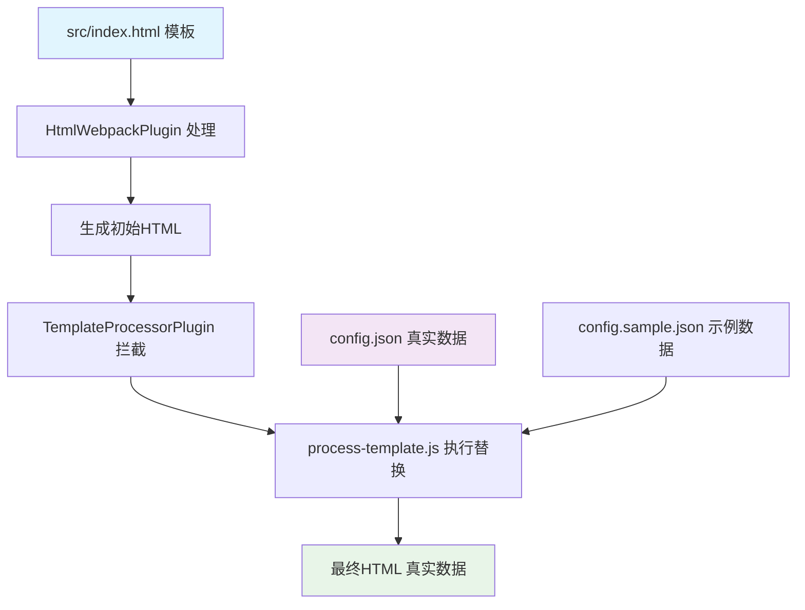

# 🎯 Modern Resume - 现代化个人简历项目

> 白舜 (whidy) - Web前端开发工程师的现代化简历项目

一个基于 **Webpack 5** + **TailwindCSS 3** 构建的现代化个人简历项目，支持多种输出格式，适配不同的使用场景。

## ✨ 项目特色

### 🎨 现代化设计
- **专业布局** - 蓝色渐变头部，卡片式设计，清晰的视觉层次
- **响应式设计** - 完美适配桌面端、平板和移动端
- **优雅动画** - 渐入和滑入动画效果，提升用户体验
- **图标支持** - 集成 Lucide 图标库，支持技术栈和联系方式图标

### 📱 多版本输出

| 版本类型 | 输出文件 | 特点 | 适用场景 |
|---------|----------|------|----------|
| **在线版** | `dist/index.html` | 交互动画，分离资源 | 网站部署，在线展示 |
| **PDF版** | `白舜-Web前端开发工程师.pdf` | 打印优化，专业排版 | 投递简历，纸质打印 |
| **单文件版** | `白舜-Web前端开发工程师-单文件版.html` | 自包含，便携分享 | 邮件发送，临时查看 |

### 🛠 技术栈

- **Webpack 5** - 模块打包和开发服务器
- **TailwindCSS 3** - 实用优先的CSS框架
- **PostCSS 8** - CSS处理和优化
- **Lucide Icons** - 现代化图标库
- **Puppeteer** - 自动化PDF生成
- **Inter Font** - 现代无衬线字体

### 🏗️ 核心架构特色

- **模板替换系统** - 智能的字符串替换机制，保护隐私的同时实现数据动态化
- **多环境配置** - 支持开发、生产、PDF等不同环境的配置
- **自定义Webpack插件** - 集成HtmlWebpackPlugin实现无缝模板处理
- **隐私优先设计** - 源码不包含敏感信息，通过配置文件管理真实数据

## 🚀 快速开始

### 环境要求

- Node.js 16+
- npm 或 yarn

### 安装依赖

```bash
npm install
```

### 开发模式

```bash
npm run dev
# 或
npm start
```

启动开发服务器，访问 http://localhost:9000

> 💡 **自动配置加载**: 开发模式会自动加载配置文件，使用真实数据进行预览

## 📦 构建命令

### 基础构建

```bash
# 构建在线版本 (用于网站部署)
npm run build

# 构建PDF优化版本
npm run build:pdf

# 构建并生成单文件版本
npm run build:inline
# 或简写
npm run inline
```

### 生成成品文件

```bash
# 生成PDF文件 (推荐)
npm run pdf

# 生成单HTML文件 (便于分享)
npm run inline
```

## 📁 项目结构

```
resume/
├── src/                          # 源码目录
│   ├── index.html               # 主HTML模板（包含示例数据作为替换占位符）
│   ├── css/index.css            # TailwindCSS样式
│   └── js/index.js              # JavaScript入口文件
├── scripts/                      # 构建脚本
│   ├── generate-pdf.js          # PDF生成脚本
│   ├── create-inline.js         # 单文件生成脚本
│   ├── process-template.js      # 模板处理核心逻辑（字符串替换）
│   ├── template-processor-plugin.js # 自定义Webpack插件
│   └── post-build.js            # 构建后处理脚本
├── config.sample.json            # 配置文件示例（假数据，供参考）
├── config.json                   # 个人配置文件（真实数据，不提交Git）
├── dist/                         # 构建输出目录
├── docs/                         # 文档资源
└── CLAUDE.md                     # Claude Code 工作指南
```

## 🏗️ 核心架构设计

### 📋 模板替换系统

项目采用**智能模板替换架构**，实现了数据与模板的完全分离：



### 🔄 工作流程详解

#### 1. 模板准备阶段
- `src/index.html` 包含完整的HTML结构和样式
- 使用示例数据作为"占位符"（如：张三、138****8888等）
- 这些占位符被 `process-template.js` 识别并替换

#### 2. 构建处理阶段
```javascript
// webpack.config.js
plugins: [
  new HtmlWebpackPlugin({
    template: "./src/index.html",  // 读取模板
  }),
  new TemplateProcessorPlugin(),   // 自定义插件处理
]
```

#### 3. 模板替换阶段
```javascript
// TemplateProcessorPlugin 工作流程
HtmlWebpackPlugin.getHooks(compilation).beforeEmit.tapAsync('TemplateProcessorPlugin', (data, callback) => {
  const config = loadConfig();                           // 加载配置
  const processedContent = processTemplate(config, data.html); // 执行替换
  data.html = processedContent;                          // 更新HTML
});
```

#### 4. 字符串替换逻辑
```javascript
// process-template.js 核心替换
templateContent = templateContent.replace(/张三 \(zhangsan\)/g, `${personalInfo.name} (${personalInfo.englishName})`);
templateContent = templateContent.replace(/138\*\*\*\*8888/g, personalInfo.phone);
templateContent = templateContent.replace(/example@example\.com/g, personalInfo.email);
// ... 更多替换规则
```

### 🔒 隐私保护机制

- **配置文件分离**: 敏感信息与代码分离，便于管理
- **Git忽略**: `config.json` 自动忽略，不会意外提交
- **假数据展示**: 没有配置时使用通用假数据
- **多级回退**: 支持多个配置文件，灵活适配不同环境
- **源码安全**: HTML模板只包含示例数据，真实信息不进入版本控制

## 🎯 使用场景

### 1. 在线展示
- 部署到 GitHub Pages、Netlify、Vercel 等平台
- 放在个人网站作为简历页面
- 响应式设计适配各种设备

### 2. PDF投递
- 一键生成高质量PDF文件
- 保持完整的设计和排版
- 适合邮件投递和打印

### 3. 便携分享
- 单HTML文件包含所有资源
- 可通过邮件直接发送
- 双击即可在任何浏览器打开

## 🔧 自定义指南

### 🔐 配置个人信息

项目支持通过配置文件管理敏感信息，保护隐私的同时便于维护：

#### 1. 创建配置文件

复制示例配置文件并修改：

```bash
cp config.sample.json config.json
```

#### 2. 编辑配置文件

编辑 `config.json` 文件，填入你的真实信息：

```json
{
  "personalInfo": {
    "name": "你的姓名",
    "englishName": "yourname", 
    "title": "你的职位",
    "experience": "N年经验",
    "phone": "你的电话",
    "email": "your@email.com",
    "age": 30,
    "gender": "男",
    "education": "本科"
  },
  "selfDescription": "你的详细自我描述...",
  "skills": {
    "frontend": ["HTML5", "CSS3", "JavaScript", "Vue.js", "React.js"],
    "backend": ["Node.js", "Python", "MySQL"],
    "tools": ["Webpack", "Git", "Docker"]
  },
  "workExperience": [
    {
      "company": "公司名称",
      "duration": "2020.01 – 2023.12",
      "position": "职位名称",
      "description": "工作描述...",
      "achievements": "主要成就..."
    }
  ],
  "projects": [
    {
      "name": "项目名称",
      "tech": "技术栈",
      "description": "项目描述...",
      "achievements": ["成就1", "成就2", "成就3"]
    }
  ],
  "education": [
    {
      "school": "学校名称",
      "degree": "学历",
      "major": "专业",
      "duration": "2015.09 - 2019.06"
    }
  ],
  "additionalInfo": [
    "✨ 开发环境：主要使用 macOS + VSCode",
    "🔍 学习能力：善用 Google、StackOverflow、GitHub"
  ],
  "footer": "感谢您认真阅读本人简历！期待有机会与贵司携手合作。"
}
```

#### 📋 配置字段详解

| 字段分类 | 字段名 | 说明 | 示例 |
|---------|--------|------|------|
| **个人信息** | `personalInfo.name` | 真实姓名 | "白舜" |
| | `personalInfo.englishName` | 英文名/用户名 | "whidy" |
| | `personalInfo.title` | 职位标题 | "Web前端开发工程师" |
| | `personalInfo.experience` | 工作经验 | "15年经验" |
| | `personalInfo.phone` | 手机号码 | "18680222005" |
| | `personalInfo.email` | 邮箱地址 | "whidy@whidy.net" |
| **技能信息** | `skills.frontend` | 前端技能数组 | ["Vue.js", "React.js"] |
| | `skills.backend` | 后端技能数组 | ["Node.js", "Python"] |
| | `skills.tools` | 工具技能数组 | ["Webpack", "Git"] |
| **工作经历** | `workExperience` | 工作经历数组 | 包含公司、职位、描述等 |
| **项目经验** | `projects` | 项目经历数组 | 包含项目名、技术栈、成就等 |
| **教育背景** | `education` | 教育经历数组 | 包含学校、学历、专业等 |

> 💡 **替换规则**: 配置文件中的每个字段都对应HTML模板中的特定占位符，系统会自动进行精确替换

#### 3. 配置文件优先级

系统按以下优先级查找配置：
1. `config.json` - 你的个人配置（不会提交到Git）
2. `config.local.json` - 本地配置文件
3. `config.sample.json` - 示例配置（默认假数据）

> 💡 **隐私保护**: `config.json` 已添加到 `.gitignore`，不会被提交到代码仓库

### 自定义样式

项目使用 TailwindCSS，可以通过以下方式自定义：

1. **配置文件**: 编辑 `tailwind.config.js`
2. **自定义CSS**: 在 `src/css/index.css` 添加样式
3. **主题色彩**: 修改 `tailwind.config.js` 中的 colors 配置

### 添加新技术图标

```javascript
// src/js/index.js
import { YourIcon } from 'lucide';

createIcons({
  icons: {
    // 添加新图标
    YourIcon,
    // ...其他图标
  }
});
```

## 🌟 架构优势分析

### ✅ 设计优势

1. **隐私保护优先**
   - 源码不包含任何敏感信息
   - 真实数据通过配置文件管理
   - 支持多环境配置（开发/生产/测试）

2. **维护性强**
   - 数据与模板完全分离
   - 修改个人信息无需触碰HTML
   - 支持版本控制和团队协作

3. **灵活性高**
   - 支持多种输出格式
   - 可轻松扩展新的替换规则
   - 支持条件性内容显示

4. **自动化程度高**
   - 一键生成多种格式
   - 自动化PDF生成
   - 智能资源内联

### 🔧 故障排除

#### 常见问题及解决方案

| 问题 | 症状 | 解决方案 |
|------|------|---------|
| **显示示例数据** | 页面显示"张三"等假数据 | 检查 `config.json` 是否存在且格式正确 |
| **构建失败** | Webpack编译错误 | 运行 `npm install` 重新安装依赖 |
| **PDF生成失败** | Puppeteer错误 | 确保系统已安装Chrome/Chromium |
| **配置不生效** | 修改配置后无变化 | 重新运行构建命令，清理 `dist/` 目录 |

#### 调试技巧

```bash
# 检查配置文件是否被正确读取
npm run build 2>&1 | grep "使用配置文件"

# 清理缓存重新构建
rm -rf dist/ && npm run build

# 验证最终输出
grep "你的姓名" dist/index.html
```

## 🌟 开发建议

### 推荐编辑器配置

使用 **VSCode** 配合以下插件获得最佳开发体验：

- [Tailwind CSS IntelliSense](https://marketplace.visualstudio.com/items?itemName=bradlc.vscode-tailwindcss) - TailwindCSS 智能提示
- [HTML CSS Support](https://marketplace.visualstudio.com/items?itemName=ecmel.vscode-html-css) - HTML/CSS 支持
- [Live Server](https://marketplace.visualstudio.com/items?itemName=ritwickdey.LiveServer) - 本地服务器预览

### 打印优化

项目已内置打印样式优化：

- A4纸张适配 (0.8cm边距)
- 背景颜色保持
- 字体大小调整
- 布局自动优化

## 🤝 贡献

欢迎提出建议和改进：

1. Fork 项目
2. 创建功能分支
3. 提交更改
4. 发起 Pull Request

## 📄 许可证

[ISC License](https://opensource.org/licenses/ISC)

## 👨‍💻 作者

**白舜 (whidy)**
- 15年Web前端开发经验
- 技术栈：Vue.js、Node.js、微信小程序等
- GitHub: [@whidy](https://github.com/whidy)
- 博客: [https://www.whidy.net](https://www.whidy.net)

---

## 🎯 项目总结

这个项目不仅是一份现代化的个人简历，更是一个**前端工程化最佳实践**的完整示例，展示了：

### 🏗️ 技术亮点
- **智能模板替换系统** - 创新的数据与模板分离架构
- **隐私保护设计** - 源码与敏感信息完全分离
- **自定义Webpack插件** - 深度集成构建流程
- **多格式输出** - 一套代码，多种用途
- **自动化工程流** - 从开发到部署的完整链路

### 🎨 设计理念
- **安全优先** - 保护个人隐私信息
- **开发友好** - 配置简单，维护方便  
- **用户体验** - 响应式设计，打印优化
- **可扩展性** - 架构清晰，易于定制

### 💼 适用场景
- **个人简历制作** - 快速生成专业简历
- **前端技术学习** - 学习现代化构建流程
- **项目模板参考** - Webpack + TailwindCSS 实践
- **隐私保护方案** - 敏感数据管理最佳实践

> 💡 **开发说明**: 模板替换系统和隐私保护架构通过 [Claude Code](https://claude.ai/code) 进行优化设计，实现了数据安全与开发效率的完美平衡。
